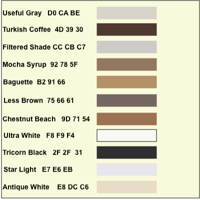

# Project Resources

This folder is for resources related to building out the project.

**Color palette**  
    
For use in CSS styling. Values are provided in hex format, using sRGB color profile.
 
**Wireframe**  
(in progress)  
For use in front-end layout.  
The .graffle file is the source file (Omnigraffle).  
The .pdf file is for reference.  

