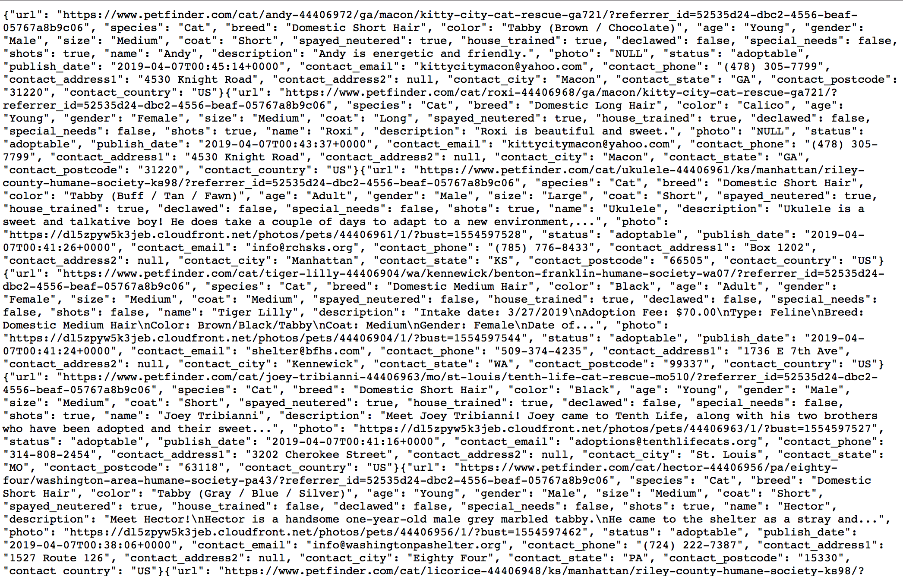
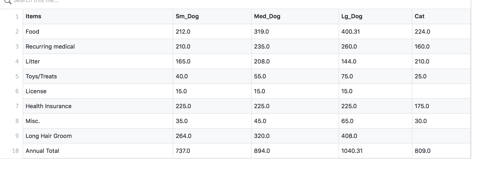
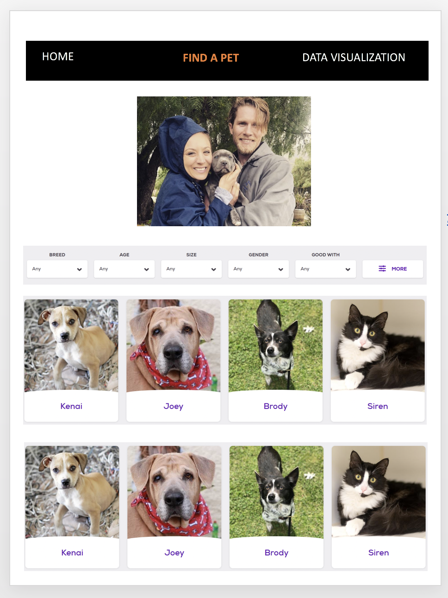

# Proposal #
Team: Petmatchers  
Team Members: Andrew B, Helen, Jin, Natalie, Srini, Troy  
Project file: https://github.com/jinkkim/project2_petmatchers

## Problem statement ##
Animal adoption is a big decision for a family.  
Many families use online resources to learn about potential pets, but the actual decision for adoption remains an emotional one. This can lead to underestimation of annual costs of care or pet temperament, and in extreme situations, lead to animals being returned to shelters.

Petmatchers provides a unique visualization experience to help families make data-driven decisions when researching or considering a particular animal. Using data from the Petfinder API, users can find a match based on their preference such as breed, age, gender, color, temperament, location, while visualizing available available animals by category. 

The Petmatchers online utility also displays pet care costs and other expenditures to help provide a comprehensive view of pet ownership. The final decision will still an emotional one, but the Petfinders application will help balance it with data.

## Dataset ##
We obtain 20,000 available adoptable animal data from nearly 14,000 shelters and rescue groups across North America from Petfinder API. We also collected initial and lifetime pet care cost data by animal, size and breed from various sources.
 - https://www.petfinder.com/developers/v2/docs/
 - https://www.aspca.org/sites/default/files/pet_care_costs.pdf
 - https://www.bls.gov/opub/ted/2017/households-spent-an-average-of-528-dollars-on-pets-in-2015.htm

Sample Data:

## Page layout ##
One main page and four subpages
-	HOME: intro, background
-	FIND A PET: provide search features with users’ preferences
-	OVERVIEW: adoptable animal analysis, report of available animals
-	MAPS: Where are adoptable animals located? Where can I meet them?
-	PET CARE COSTS ANALYSIS: the cost of owning a dog or cat

Example page:

